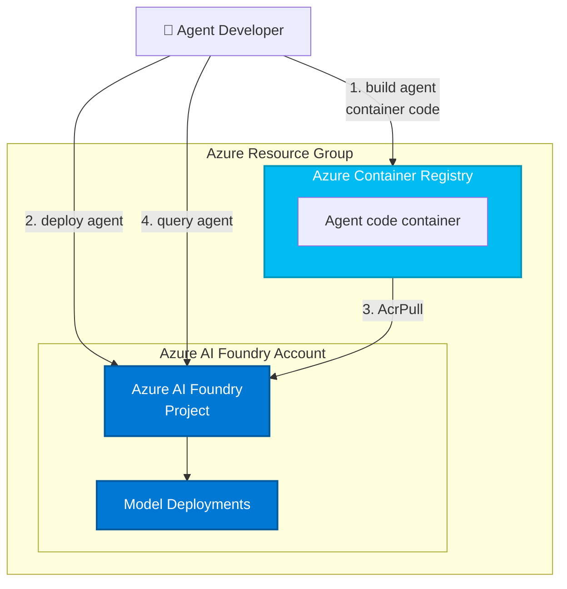

# Microsoft Foundry `azd` Bicep スターター キット (基本)

この Azure Developer CLI (azd) テンプレートは、AI エージェントを構築して実行するための Microsoft Foundry リソースをプロビジョニングしてデプロイする合理化された方法を提供します。 これには、コードとしてのインフラストラクチャの定義とサンプル アプリケーション コードが含まれており、モデルのデプロイ、ワークスペースの構成、ストレージやコンテナーのホスティングなどのサポート サービスなど、Microsoft Foundry のエージェント機能をすぐに使い始めるのに役立ちます。

このテンプレートには、エージェント コードやアプリケーション コードは**含まれていません**。 他のリポジトリに次のようなサンプルがあります。[foundry-samples](https://github.com/azure-ai-foundry/foundry-samples):
- [hosted agents サンプル (python)](https://github.com/azure-ai-foundry/foundry-samples/tree/main/samples/python/hosted-agents)
- [hosted agents サンプル (C#)](https://github.com/azure-ai-foundry/foundry-samples/tree/main/samples/csharp/hosted-agents)

[機能](#features) • [はじめに](#getting-started) • [ガイダンス](#guidance)

このテンプレートおよびこれに含まれるアプリケーション コードと構成は、Microsoft Azure の特定のサービスとツールを紹介するために構築されています。 追加のセキュリティ機能を実装または有効化せずに、このコードを運用環境の一部として使用されないことをお客様に強くお勧めします。

これらのテンプレートを使用して作成するすべての AI ソリューションでは、関連するすべてのリスクを評価し、適用されるすべての法律と安全基準に準拠する責任があります。 詳細については、[Agent Service](https://learn.microsoft.com/en-us/azure/ai-foundry/responsible-ai/agents/transparency-note) および [Agent Framework](https://github.com/microsoft/agent-framework/blob/main/TRANSPARENCY_FAQ.md) の透明性に関するドキュメントを参照してください。

## 機能

このプロジェクト フレームワークには、次の機能が用意されています。

* **Microsoft Foundry プロジェクト**:プロジェクト構成を使用した Microsoft Foundry ワークスペースの完全なセットアップ
* **Foundry モデルのデプロイ**:エージェント機能のための AI モデルの自動展開
* **Azure Container Registry**:エージェント デプロイ用のコンテナー イメージのストレージと管理
* **マネージド ID**:サービス間のキーレス認証向けの組み込みの Azure マネージド ID

### アーキテクチャの図

このスタート キットでは、ホストされているエージェントが機能するための必要最小限のプロビジョニングが行われます (`ENABLE_HOSTED_AGENTS=true` の場合)。

| リソース | 説明 |
|----------|-------------|
| [Microsoft Foundry](https://learn.microsoft.com/azure/ai-foundry) | モデル、データ、コンピューティング リソースにアクセスできる AI 開発用のコラボレーション ワークスペースを提供 |
| [Azure Container Registry](https://learn.microsoft.com/azure/container-registry/) | 安全なデプロイのためのコンテナー イメージの格納と管理 |
| [Application Insights](https://learn.microsoft.com/azure/azure-monitor/app/app-insights-overview) | *省略可能* - デバッグと最適化のためのアプリケーション パフォーマンスの監視、ログ、テレメトリの提供 |
| [Log Analytics ワークスペース](https://learn.microsoft.com/azure/azure-monitor/logs/log-analytics-workspace-overview) | *省略可能* - 監視とトラブルシューティングのためのテレメトリ データの収集と分析 |

これらのリソースは、エージェントをビルドおよびデプロイする際に [`azd ai agent` 拡張機能](https://aka.ms/azdaiagent/docs)で使用されます。



テンプレートはパラメーター化されるため、次に示すようなエージェントの要件に応じて追加のリソースを使用して構成できます。

* モデル デプロイ構成の一覧で `AI_PROJECT_DEPLOYMENTS` を設定して AI モデルをデプロイする、
* `AI_PROJECT_DEPENDENT_RESOURCES` を設定して追加のリソース (Azure AI 検索、Bing 検索) をプロビジョニングする、
* `ENABLE_MONITORING=true` (既定でオン) を設定して監視を有効にする、
* 接続構成の一覧で `AI_PROJECT_CONNECTIONS` 設定して、接続をプロビジョニングする。

## 作業の開始

注: このリポジトリは複製されることではなく、独自のプロジェクトのテンプレートとして使用されることを目的としています。

```bash
azd init --template Azure-Samples/ai-foundry-starter-basic
```

### 前提条件

* [azd](https://aka.ms/install-azd) をインストールします
  * Windows: `winget install microsoft.azd`
  * Linux: `curl -fsSL https://aka.ms/install-azd.sh | bash`
  * MacOS: `brew tap azure/azd && brew install azd`

### クイックスタート

1. テンプレート コードを取得します。

    ```shell
    azd init --template Azure-Samples/ai-foundry-starter-basic
    ```

    これにより、git clone が実行されます

2. お使いの Azure アカウントにサインインします。

    ```shell
    azd auth login
    ```

3. GitHub からサンプル エージェントをダウンロードします。

    ```shell
    azd ai agent init -m <repo-path-to-agent.yaml>
    ```

エージェントのサンプルは、[`foundry-samples` リポジトリ](https://github.com/azure-ai-foundry/foundry-samples/tree/main/samples/microsoft/python/getting-started-agents/hosted-agents)にあります。

## ガイダンス

### 利用可能なリージョン

このテンプレートでは、特定のモデルは使用されません。 モデルのデプロイは、テンプレートのパラメーターです。 各モデルは、Azure リージョンによっては使用できないこともあります。 [Microsoft Foundry の最新のリージョンの可用性](https://learn.microsoft.com/en-us/azure/ai-foundry/reference/region-support)、特に[エージェント サービス](https://learn.microsoft.com/en-us/azure/ai-foundry/agents/concepts/model-region-support?tabs=global-standard)をご確認ください。

## リソースのクリーンアップ

不要な料金の発生を避けるため、アプリケーションでの作業が完了した後で、Azure リソースをクリーンアップすることが重要です。

- **クリーンアップするタイミング:**
  - アプリケーションのテストまたはデモンストレーションが完了した後。
  - アプリケーションが不要になった場合、または別のプロジェクトまたは環境に切り替えた場合。
  - 開発が完了し、アプリケーションの使用を停止する準備ができたとき。

- **リソースの削除:** 関連付けられているすべてのリソースを削除し、アプリケーションをシャットダウンするには、次のコマンドを実行します。
  
    ```bash
    azd down
    ```

    このプロセスが完了するまでに最大 20 分かかる場合があることに注意してください。

⚠️ または、Azure portal から直接リソース グループを削除して、リソースをクリーンアップすることもできます。

### コスト

価格はリージョンと使用状況によって異なるため、使用量の正確なコストを予測することはできません。
このインフラストラクチャで使用される Azure リソースの大部分は、使用量ベースの価格レベルに基づいています。

このテンプレートにデプロイされているリソースについては、[Azure 料金計算ツール](https://azure.microsoft.com/pricing/calculator)をお試しください。

* **Microsoft Foundry**:Standard レベル [Pricing](https://azure.microsoft.com/pricing/details/ai-foundry/)
* **Azure AI サービス**:S0 レベル。既定値は gpt-4o-mini です。 価格はトークン数に基づいています。 [Pricing](https://azure.microsoft.com/pricing/details/cognitive-services/)
* **Azure Container Registry**:Basic SKU。 価格は 1 日単位で、ストレージ使用量に基づきます。 [Pricing](https://azure.microsoft.com/en-us/pricing/details/container-registry/)
* **Azure Storage アカウント**:Standard レベル、LRS。 価格はストレージ使用量と操作に基づきます。 [Pricing](https://azure.microsoft.com/pricing/details/storage/blobs/)
* **ログ分析**:従量課金制レベル。 コストは取り込まれたデータに基づきます。 [Pricing](https://azure.microsoft.com/pricing/details/monitor/)
* **[Azure AI 検索]**:Basic レベル、LRS。 価格は 1 日単位で、トランザクションに基づきます。 [Pricing](https://azure.microsoft.com/en-us/pricing/details/search/)
* **Bing 検索を使用した典拠**:G1 レベル。 トランザクションに基づくコスト。 [Pricing](https://www.microsoft.com/en-us/bing/apis/grounding-pricing)

⚠️ 不要なコストを回避するために、アプリが使用されなくなった場合は、ポータルでリソース グループを削除するか、`azd down` を実行してアプリを停止することを忘れないでください。

### セキュリティ ガイドライン

このテンプレートでは、ローカルの開発とデプロイに[マネージド ID](https://learn.microsoft.com/entra/identity/managed-identities-azure-resources/overview) も使用されます。

独自のリポジトリで継続的なベスト プラクティスを確保するには、テンプレートに基づいてソリューションを作成するすべてのユーザーが、[Github シークレット スキャン](https://docs.github.com/code-security/secret-scanning/about-secret-scanning)設定が有効であることを確認することをお勧めします。

次のような追加のセキュリティ対策を検討できます。

- Microsoft Defender for Cloud を有効にして、[Azure リソースをセキュリティで保護する](https://learn.microsoft.com/azure/defender-for-cloud/)。
- [ファイアウォール](https://learn.microsoft.com/azure/container-apps/waf-app-gateway)または [Virtual Network](https://learn.microsoft.com/azure/container-apps/networking?tabs=workload-profiles-env%2Cazure-cli) を使用して Azure Container Apps インスタンスを保護する。

> **セキュリティに関する重要なお知らせ** <br/>
このテンプレートおよびこれに含まれるアプリケーション コードと構成は、Microsoft Azure の特定のサービスとツールを紹介するために構築されています。 追加のセキュリティ機能を実装または有効化せずに、このコードを運用環境の一部として使用されないことをお客様に強くお勧めします。  <br/><br/>
インテリジェント アプリケーションのベスト プラクティスとセキュリティに関する推奨事項のより包括的な一覧については、[公式ドキュメントを参照してください](https://learn.microsoft.com/en-us/azure/ai-foundry/)。

## その他の免責事項

**商標** このプロジェクトには、プロジェクト、製品、またはサービスの商標またはロゴが含まれている場合があります。 Microsoft の商標またはロゴの使用は、「[マイクロソフトの商標およびブランド ガイドライン](https://www.microsoft.com/en-us/legal/intellectualproperty/trademarks/usage/general)」の対象となり、これに従う必要があります。 このプロジェクトの変更されたバージョンで Microsoft の商標またはロゴを使用することによって、混乱を招いたり、Microsoft のスポンサーシップを暗示することのないようご注意ください。 サード パーティの商標またはロゴの使用には、これらのサード パーティのポリシーが適用されます。

本ソフトウェアに、Microsoft Azure サービス (総称して "Microsoft 製品およびサービス") を含むがこれに限定されない Microsoft 製品またはサービスで使用される、またはそれらから派生したコンポーネントまたはコードが含まれている場合、お客様は、該当する Microsoft 製品およびサービスに適用される製品使用条件にも準拠する必要があります。 お客様は、本ソフトウェアを管理するライセンスが、Microsoft 製品およびサービスを使用するライセンスまたはその他の権利を付与しないことに同意するものとします。 本ライセンスまたはこの ReadMe ファイルのいかなる内容も、Microsoft 製品およびサービスの製品使用条件の条項に優先せず、これを修正、終了、または変更するものではありません。

お客様は、本ソフトウェアに適用されるすべての国内および国際輸出法 (仕向国、エンド ユーザー、最終用途に関する制限を含む) も遵守しなければなりません。 輸出規制の詳細については、<https://aka.ms/exporting> を確認してください。

お客様は、本ソフトウェアと Microsoft 製品およびサービスが (1) 医療機器として設計、意図、または提供されていないこと、(2) 専門家の医学的アドバイス、診断、治療、または判断に代わるものとして設計、意図されておらず、専門家の医学的アドバイス、診断、治療、または判断に代わるものとして使用されるものではないことを認めるものとします。 エンド ユーザーに対するお客様によるオンライン サービスの実装の適切な同意、警告、免責事項、ならびに確認の表示および/または取得のすべての責任は、お客様が単独で負うものとします。

お客様は、本ソフトウェアが SOC 1 および SOC 2 コンプライアンス監査の対象になっていないことを認めるものとします。 本ソフトウェアを含む Microsoft のテクノロジ、およびそのコンポーネント テクノロジは、認定された金融サービス専門家の専門的なアドバイス、意見、または判断の代わりとして意図されておらず、また利用されるものではありません。 本ソフトウェアを、専門的な財務上の助言や判断に代わるもの、その代用、またはそれらを提供するものとして使用しないでください。  

本ソフトウェアにアクセスまたはこれを使用することにより、お客様は、本ソフトウェアのサービス中断、瑕疵、エラー、またはその他の障害によって、人の死亡または重大な身体的損傷、あるいは物理的または環境的損害 (総称して "危険性の高い使用") を引き起こすおそれのある使用を支援するようソフトウェアが設計または意図されていないことを認め、ソフトウェアにいかなる中断、瑕疵、エラー、またはその他の障害が発生した場合も、人、財産、環境の安全性は、一般的または特定の業種において合理的、適切かつ法的なレベルを下回らないことを保証するものとします。 お客様は、本ソフトウェアにアクセスすることにより、お客様の本ソフトウェアの危険度の高い使用が自己の責任において行われることを認めるものとします。
