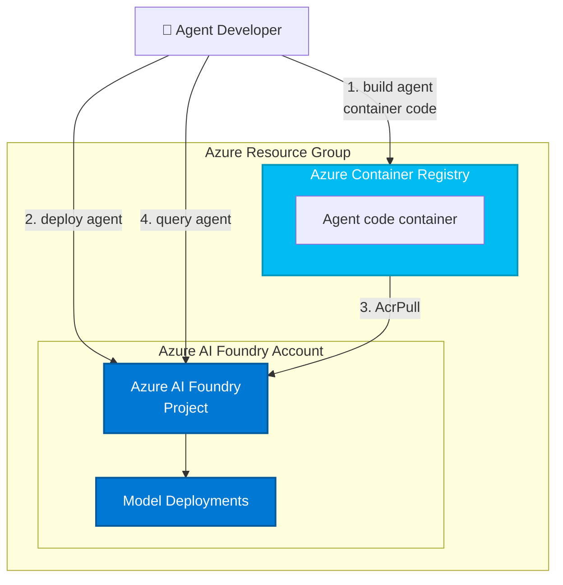

# Microsoft Foundry を使用した GenAIOps ラーニング パス

このリポジトリには、Microsoft Foundry を使用して GenAIOps プラクティスを実装するためのハンズオン ラボが用意されています。 完全な AI 開発ライフサイクルをカバーする実用的な演習を通じて、運用に対応した生成 AI アプリケーションを構築、評価、デプロイ、監視する方法について学びます。

## 📚 ラーニング パス

このリポジトリには、個別に、または一緒に完了できる 2 つの補完的なラーニング パスが含まれています:

---

## ラーニング パス 1:生成 AI アプリケーションの運用化 (GenAIOps)

体系的なワークフローを使用して、運用に対応した生成 AI アプリケーションを構築、評価、デプロイします。

1. **[GenAIOps ソリューションの計画と準備](docs/01-infrastructure-setup.md)** - AI アプリケーションの基盤となるインフラストラクチャと開発ワークフローを確立する
2. **[GitHub を使用してエージェント成果物を管理する](docs/02-prompt-management.md)** - GitHub を使用してエージェント、プロンプト、モデル、その他の AI 成果物を整理およびバージョン管理する
3. **[プロンプトの設計と最適化](docs/03-design-optimize-prompts.md)** - 体系的なプロンプト エンジニアリング、反復手法、最適化戦略について学習する
4. **GenAI の RAG ソリューションの最適化** *(近日公開予定)* - コンテキスト対応 AI の検索拡張生成パターンを実装する
5. **GenAI のカスタム微調整ワークフローを作成する** *(近日公開予定)* - モデルのカスタマイズのための自動パイプラインを構築する
6. **CI/CD 統合を使用して GenAI アプリとエージェントをデプロイする** *(近日公開予定)* - 継続的デリバリーのためのデプロイ パイプラインの自動化

---

## ラーニング パス 2:GenAI アプリケーションとエージェント用の監視を実装する

包括的な監視プラクティスを使用して、運用環境で AI アプリケーションを監視、トレース、デバッグ、最適化します。

1. **監視戦略の計画と準備** *(近日公開予定)* - AI システムの包括的な監視アプローチを設計する
2. **シミュレートされた入力を使用してモデル リスクを評価する** *(近日公開予定)* - エッジ ケースや敵対的シナリオに対して運用モデルをテストする
3. **評価パイプラインの構築** *(近日公開予定)* - デプロイ ワークフローで品質ゲートとパフォーマンス ベンチマークを自動化する
4. **生成 AI セキュリティのためのレッドチーム パイプラインを構築して実行する** *(近日公開予定)* - 自動化されたセキュリティ テストと敵対的評価を実装する
5. **[生成 AI アプリケーションの監視](docs/06-deployment-monitoring.md)** - エージェントをデプロイし、Application Insights、Log Analytics、テレメトリ収集を構成する
6. **トレースを使用した生成 AI アプリの分析とデバッグ** *(近日公開予定)* - 分散トレースを使用して AI アプリケーションの問題を診断し、エージェントの動作を理解する
7. **パフォーマンスとコストの最適化** *(近日公開予定)* - 品質を維持しながら待機時間とトークンの消費を削減する
8. **GenAI アプリのセキュリティとガバナンスの実装** *(近日公開予定)* - エンタープライズ セキュリティ コントロールとコンプライアンス要件を適用する

---

## 📚 基本ラボ

これらのラボは、両方のラーニング パスに不可欠なスキルを提供し、また個別に完了できます:

- **[GenAIOps ソリューションの計画と準備](docs/01-infrastructure-setup.md)** - Microsoft Foundry リソースをデプロイし、開発環境を構成する (両方のパスの前提条件)
- **[手動評価](docs/03-manual-evaluation.md)** - エージェント応答の人間によるループ内評価を実施する
- **[自動評価](docs/04-automated-evaluation.md)** - シミュレートされた入力と AI 支援の評価を使用して評価パイプラインを構築する
- **[安全性とレッド チーム](docs/05-safety-red-teaming.md)** - AI システムのセキュリティ リスクと敵対的シナリオをテストする

---

## 🎯 構築する内容

これらのラーニング パス全体を通して、現実的なシナリオを使用します:**Adventure Works Trail Guide Agent** - この AI 搭載アシスタントは、ハイカーがトレイル冒険の計画、おすすめギアの取得、リアルタイム サポートを受ける支援を行います。

### ラーニング パス 1 の結果
- ✅ 運用環境の AI アプリケーション用に GenAIOps ソリューションを計画および準備する
- ✅ GitHub を使用してエージェント成果物の整理とバージョン管理を行う
- ✅ 体系的なエンジニアリング手法を使用してプロンプトを設計および最適化する
- ✅ 検索拡張生成 (RAG) パターンを実装する
- ✅ モデル最適化のためのカスタム微調整ワークフローを作成する
- ✅ CI/CD パイプラインを使用してデプロイを自動化する

### ラーニング パス 2 の結果
- ✅ AI システムの包括的な監視戦略を設計する
- ✅ Application Insights を使用して監視インフラストラクチャを構成する
- ✅ エージェントの会話と API 呼び出しのトレースとデバッグ
- ✅ シミュレートされた運用シナリオでモデルの動作を評価する
- ✅ 品質を維持しながらコストとパフォーマンスを最適化する
- ✅ セキュリティ コントロールとガバナンス ポリシーを実装する

[機能](#features) • [はじめに](#getting-started) • [ガイダンス](#guidance)

## 🧪 サンプル エージェントとツール

このリポジトリには、ラーニング ラボをサポートするいくつかのサンプル エージェントとツールが含まれています:

### エージェント

- **トレイル ガイド エージェント** (`src/agents/trail_guide_agent/`) - 迅速な進化とバージョン管理を示すマルチバージョン エージェント
  - V1:基本的なトレイルのおすすめ
  - V2:宿泊施設やギアの提案で強化
  - V3:高度な安全性監視とカスタマイズ

- **監視エージェント** (`src/agents/monitoring_agent/`) - エラー処理、プロンプトの最適化、監視パターンの例

### ツールとユーティリティ

- **モデルの比較** (`src/agents/model_comparison/`) - さまざまなモデル構成間でパフォーマンスを比較する
  - ベンチマーク用の対話型ノートブック
  - モデル分析用の視覚化ツール

- **プロンプトの最適化** (`src/agents/prompt_optimization/`) - プロンプトを反復処理および改善するためのツール
  - トークン カウント ユーティリティ
  - A/B テスト フレームワーク

- **エバリュエータ** (`src/evaluators/`) - 品質と安全性の評価モジュール
  - 応答精度の品質エバリュエータ
  - 敵対的テストの安全性エバリュエータ

- **テスト** (`src/tests/`) - エージェントの動作検証のための自動テスト スイート

## 📋 前提条件

ラボを開始する前に、次のことを確認します:

- **Microsoft Foundry アクセス権を持つ Azure サブスクリプション**
- **Python 拡張機能を備えた Visual Studio Code**
- **Python 3.9 以降**
- **Azure CLI** (`az`) - [インストール](https://learn.microsoft.com/cli/azure/install-azure-cli)
- **Azure Developer CLI** (`azd`) - [インストール](https://aka.ms/install-azd)
- **Git** と **GitHub アカウント**

---

## 🚀 おすすめの追加ラボ

このリポジトリの既存のコードと新しい Microsoft Foundry エクスペリエンスに基づいて、次のラボを追加することをおすすめします:

### ラーニング パス 1:GenAIOps 拡張機能
- **典拠ありの RAG**:既存の Bing 検索と Azure AI Search インフラストラクチャを使用して、検索拡張生成パターンを構築する
- **モデル比較ラボ**:`src/agents/model_comparison/` ノートブックを活用して、GPT-4、GPT-4o、その他のモデルを体系的に比較する
- **プロンプト エンジニアリングの詳細**:`src/agents/prompt_optimization/` を使用して体系的なプロンプト イテレーションとトークンの最適化を教える
- **カスタム エバリュエータ**:`src/evaluators/quality_evaluators.py` を拡張するドメイン固有のエバリュエータを構築する
- **合成データ生成**:既存の `generate_synth_data.py` を使用して評価データセットを作成する
- **マルチエージェント テスト**:トレイル ガイド エージェントとその他の特殊なエージェント間の対話をテストする

### ラーニング パス 2:監視の拡張機能
- **Foundry トレース UI**:組み込みの監視機能を使用してエージェントの会話をデバッグする
- **コスト分析ダッシュボード**:支出を追跡して最適化するためのカスタム監視ビューを作成する
- **運用環境での A/B テスト**:複数のエージェント バージョンをデプロイし、ライブ パフォーマンス メトリックを比較する
- **インシデント応答プレイブック**:`src/agents/monitoring_agent/` エラー処理パターンを使用して Runbook を構築する
- **パフォーマンス プロファイル**:低速な LLM 呼び出しとデータ操作を特定して最適化する
- **異常検出**:通常とは異なる使用パターンまたは品質低下に対する自動アラートを設定する

### クロスパス ラボ
- **プロジェクト マネジメントとコラボレーション**:マルチユーザー ワークフロー、エージェントの共有、アクセス許可の管理
- **エージェントのツールと機能**:カスタム ツールと API 統合を使用してエージェントを拡張する
- **デプロイ スロット**:ブルーグリーン デプロイと安全なロールアウト戦略

このテンプレートおよびこれに含まれるアプリケーション コードと構成は、Microsoft Azure の特定のサービスとツールを紹介するために構築されています。 追加のセキュリティ機能を実装または有効化せずに、このコードを運用環境の一部として使用されないことをお客様に強くお勧めします。

これらのテンプレートを使用して作成するすべての AI ソリューションでは、関連するすべてのリスクを評価し、適用されるすべての法律と安全基準に準拠する責任があります。 詳細については、[Agent Service](https://learn.microsoft.com/en-us/azure/ai-foundry/responsible-ai/agents/transparency-note) および [Agent Framework](https://github.com/microsoft/agent-framework/blob/main/TRANSPARENCY_FAQ.md) の透明性に関するドキュメントを参照してください。

## 機能

このラーニング リポジトリでは、次のものが提供されます:

### コードとしてのインフラストラクチャ
* **Microsoft Foundry プロジェクト**:プロジェクトの構成とモデルのデプロイを使用してセットアップを完了する
* **Azure Container Registry**:エージェント デプロイ用のコンテナー イメージ ストレージ
* **スタックの監視**:監視のための Application Insights と Log Analytics
* **マネージド ID**:サービス間のキーレス認証

### GenAIOps の機能
* **プロンプトのバージョン管理**:バージョン コントロール統合を使用してプロンプトをコードとして管理する
* **マルチモデル テスト**:モデル構成間でパフォーマンスを比較する
* **自動評価**:AI 支援による評価と品質評価のパイプライン
* **安全性テスト**:レッド チームと敵対的シナリオのテスト
* **運用の監視**:トレース、ログ記録、パフォーマンスの最適化
* **CI/CD 統合**: デプロイとテストのワークフローの自動化

### アーキテクチャの図

このスタート キットでは、ホストされているエージェントが機能するための必要最小限のプロビジョニングが行われます (`ENABLE_HOSTED_AGENTS=true` の場合)。

| リソース | 説明 |
|----------|-------------|
| [Microsoft Foundry](https://learn.microsoft.com/azure/ai-foundry) | モデル、データ、コンピューティング リソースにアクセスできる AI 開発用のコラボレーション ワークスペースを提供 |
| [Azure Container Registry](https://learn.microsoft.com/azure/container-registry/) | 安全なデプロイのためのコンテナー イメージの格納と管理 |
| [Application Insights](https://learn.microsoft.com/azure/azure-monitor/app/app-insights-overview) | *省略可能* - デバッグと最適化のためのアプリケーション パフォーマンスの監視、ログ、テレメトリの提供 |
| [Log Analytics ワークスペース](https://learn.microsoft.com/azure/azure-monitor/logs/log-analytics-workspace-overview) | *省略可能* - 監視とトラブルシューティングのためのテレメトリ データの収集と分析 |

これらのリソースは、エージェントをビルドおよびデプロイする際に [`azd ai agent` 拡張機能](https://aka.ms/azdaiagent/docs)で使用されます。



テンプレートはパラメーター化されるため、次に示すようなエージェントの要件に応じて追加のリソースを使用して構成できます。

* モデル デプロイ構成の一覧で `AI_PROJECT_DEPLOYMENTS` を設定して AI モデルをデプロイする、
* `AI_PROJECT_DEPENDENT_RESOURCES` を設定して追加のリソース (Azure AI 検索、Bing 検索) をプロビジョニングする、
* `ENABLE_MONITORING=true` (既定でオン) を設定して監視を有効にする、
* 接続構成の一覧で `AI_PROJECT_CONNECTIONS` 設定して、接続をプロビジョニングする。

## 作業の開始

### ラーニング パスの参加者の場合

**ラーニング パス 1:生成 AI アプリケーションの運用化 (GenAIOps)**
- 前提条件として [GenAIOps ソリューションの計画と準備](docs/01-infrastructure-setup.md)を完了する
- モジュール 2 から始める:[GitHub を使用してエージェント成果物を管理する](docs/02-prompt-management.md)
- 6 つのモジュールをすべて順番に実行する
- 各ラボは、Trail Guide Agent を使用した以前の作業に基づいて作成されています

**ラーニング パス 2:GenAI アプリケーションの監視を実装する**
- 個別に開始することも、ラーニング パス 1 の後に開始することもできます
- 監視戦略の計画から始める
- モジュール 5:[生成 AI アプリケーションの監視](docs/06-deployment-monitoring.md)では、デプロイと監視のセットアップについて説明します
- 既存の AI アプリケーションが必要です (ラーニング パス 1 の Trail Guide Agent を使用するか、独自のものを使用する)

どちらのパスも、次のものが含まれます:
- 明確な学習目標
- 詳細な手順
- 検証チェックポイント
- ハンズオン演習

### テンプレート ユーザーの場合

このリポジトリは、新しい Microsoft Foundry プロジェクトをブートストラップするための `azd` テンプレートとしても機能します:

```bash
azd init --template Azure-Samples/ai-foundry-starter-basic
```

これにより、学習教材なしでインフラストラクチャがプロビジョニングされます。

### 前提条件

## ガイダンス

### 利用可能なリージョン

このテンプレートでは、特定のモデルは使用されません。 モデルのデプロイは、テンプレートのパラメーターです。 各モデルは、Azure リージョンによっては使用できないこともあります。 [Microsoft Foundry の最新のリージョンの可用性](https://learn.microsoft.com/en-us/azure/ai-foundry/reference/region-support)、特に[エージェント サービス](https://learn.microsoft.com/en-us/azure/ai-foundry/agents/concepts/model-region-support?tabs=global-standard)をご確認ください。

## リソースのクリーンアップ

不要な料金の発生を避けるため、アプリケーションでの作業が完了した後で、Azure リソースをクリーンアップすることが重要です。

- **クリーンアップするタイミング:**
  - アプリケーションのテストまたはデモンストレーションが完了した後。
  - アプリケーションが不要になった場合、または別のプロジェクトまたは環境に切り替えた場合。
  - 開発が完了し、アプリケーションの使用を停止する準備ができたとき。

- **リソースの削除:** 関連付けられているすべてのリソースを削除し、アプリケーションをシャットダウンするには、次のコマンドを実行します。
  
    ```bash
    azd down
    ```

    このプロセスが完了するまでに最大 20 分かかる場合があることに注意してください。

⚠️ または、Azure portal から直接リソース グループを削除して、リソースをクリーンアップすることもできます。

### コスト

価格はリージョンと使用状況によって異なるため、使用量の正確なコストを予測することはできません。
このインフラストラクチャで使用される Azure リソースの大部分は、使用量ベースの価格レベルに基づいています。

このテンプレートにデプロイされているリソースについては、[Azure 料金計算ツール](https://azure.microsoft.com/pricing/calculator)をお試しください。

* **Microsoft Foundry**:Standard レベル [Pricing](https://azure.microsoft.com/pricing/details/ai-foundry/)
* **Azure AI サービス**:S0 レベル。既定値は gpt-4o-mini です。 価格はトークン数に基づいています。 [Pricing](https://azure.microsoft.com/pricing/details/cognitive-services/)
* **Azure Container Registry**:Basic SKU。 価格は 1 日単位で、ストレージ使用量に基づきます。 [Pricing](https://azure.microsoft.com/en-us/pricing/details/container-registry/)
* **Azure Storage アカウント**:Standard レベル、LRS。 価格はストレージ使用量と操作に基づきます。 [Pricing](https://azure.microsoft.com/pricing/details/storage/blobs/)
* **ログ分析**:従量課金制レベル。 コストは取り込まれたデータに基づきます。 [Pricing](https://azure.microsoft.com/pricing/details/monitor/)
* **[Azure AI 検索]**:Basic レベル、LRS。 価格は 1 日単位で、トランザクションに基づきます。 [Pricing](https://azure.microsoft.com/en-us/pricing/details/search/)
* **Bing 検索を使用した典拠**:G1 レベル。 トランザクションに基づくコスト。 [Pricing](https://www.microsoft.com/en-us/bing/apis/grounding-pricing)

⚠️ 不要なコストを回避するために、アプリが使用されなくなった場合は、ポータルでリソース グループを削除するか、`azd down` を実行してアプリを停止することを忘れないでください。

### セキュリティ ガイドライン

このテンプレートでは、ローカルの開発とデプロイに[マネージド ID](https://learn.microsoft.com/entra/identity/managed-identities-azure-resources/overview) も使用されます。

独自のリポジトリで継続的なベスト プラクティスを確保するには、テンプレートに基づいてソリューションを作成するすべてのユーザーが、[Github シークレット スキャン](https://docs.github.com/code-security/secret-scanning/about-secret-scanning)設定が有効であることを確認することをお勧めします。

次のような追加のセキュリティ対策を検討できます。

- Microsoft Defender for Cloud を有効にして、[Azure リソースをセキュリティで保護する](https://learn.microsoft.com/azure/defender-for-cloud/)。
- [ファイアウォール](https://learn.microsoft.com/azure/container-apps/waf-app-gateway)または [Virtual Network](https://learn.microsoft.com/azure/container-apps/networking?tabs=workload-profiles-env%2Cazure-cli) を使用して Azure Container Apps インスタンスを保護する。

> **セキュリティに関する重要なお知らせ** <br/>
このテンプレートおよびこれに含まれるアプリケーション コードと構成は、Microsoft Azure の特定のサービスとツールを紹介するために構築されています。 追加のセキュリティ機能を実装または有効化せずに、このコードを運用環境の一部として使用されないことをお客様に強くお勧めします。  <br/><br/>
インテリジェント アプリケーションのベスト プラクティスとセキュリティに関する推奨事項のより包括的な一覧については、[公式ドキュメントを参照してください](https://learn.microsoft.com/en-us/azure/ai-foundry/)。

## その他の免責事項

**商標** このプロジェクトには、プロジェクト、製品、またはサービスの商標またはロゴが含まれている場合があります。 Microsoft の商標またはロゴの使用は、「[マイクロソフトの商標およびブランド ガイドライン](https://www.microsoft.com/en-us/legal/intellectualproperty/trademarks/usage/general)」の対象となり、これに従う必要があります。 このプロジェクトの変更されたバージョンで Microsoft の商標またはロゴを使用することによって、混乱を招いたり、Microsoft のスポンサーシップを暗示することのないようご注意ください。 サード パーティの商標またはロゴの使用には、これらのサード パーティのポリシーが適用されます。

本ソフトウェアに、Microsoft Azure サービス (総称して "Microsoft 製品およびサービス") を含むがこれに限定されない Microsoft 製品またはサービスで使用される、またはそれらから派生したコンポーネントまたはコードが含まれている場合、お客様は、該当する Microsoft 製品およびサービスに適用される製品使用条件にも準拠する必要があります。 お客様は、本ソフトウェアを管理するライセンスが、Microsoft 製品およびサービスを使用するライセンスまたはその他の権利を付与しないことに同意するものとします。 本ライセンスまたはこの ReadMe ファイルのいかなる内容も、Microsoft 製品およびサービスの製品使用条件の条項に優先せず、これを修正、終了、または変更するものではありません。

お客様は、本ソフトウェアに適用されるすべての国内および国際輸出法 (仕向国、エンド ユーザー、最終用途に関する制限を含む) も遵守しなければなりません。 輸出規制の詳細については、<https://aka.ms/exporting> を確認してください。

お客様は、本ソフトウェアと Microsoft 製品およびサービスが (1) 医療機器として設計、意図、または提供されていないこと、(2) 専門家の医学的アドバイス、診断、治療、または判断に代わるものとして設計、意図されておらず、専門家の医学的アドバイス、診断、治療、または判断に代わるものとして使用されるものではないことを認めるものとします。 エンド ユーザーに対するお客様によるオンライン サービスの実装の適切な同意、警告、免責事項、ならびに確認の表示および/または取得のすべての責任は、お客様が単独で負うものとします。

お客様は、本ソフトウェアが SOC 1 および SOC 2 コンプライアンス監査の対象になっていないことを認めるものとします。 本ソフトウェアを含む Microsoft のテクノロジ、およびそのコンポーネント テクノロジは、認定された金融サービス専門家の専門的なアドバイス、意見、または判断の代わりとして意図されておらず、また利用されるものではありません。 本ソフトウェアを、専門的な財務上の助言や判断に代わるもの、その代用、またはそれらを提供するものとして使用しないでください。  

本ソフトウェアにアクセスまたはこれを使用することにより、お客様は、本ソフトウェアのサービス中断、瑕疵、エラー、またはその他の障害によって、人の死亡または重大な身体的損傷、あるいは物理的または環境的損害 (総称して "危険性の高い使用") を引き起こすおそれのある使用を支援するようソフトウェアが設計または意図されていないことを認め、ソフトウェアにいかなる中断、瑕疵、エラー、またはその他の障害が発生した場合も、人、財産、環境の安全性は、一般的または特定の業種において合理的、適切かつ法的なレベルを下回らないことを保証するものとします。 お客様は、本ソフトウェアにアクセスすることにより、お客様の本ソフトウェアの危険度の高い使用が自己の責任において行われることを認めるものとします。
